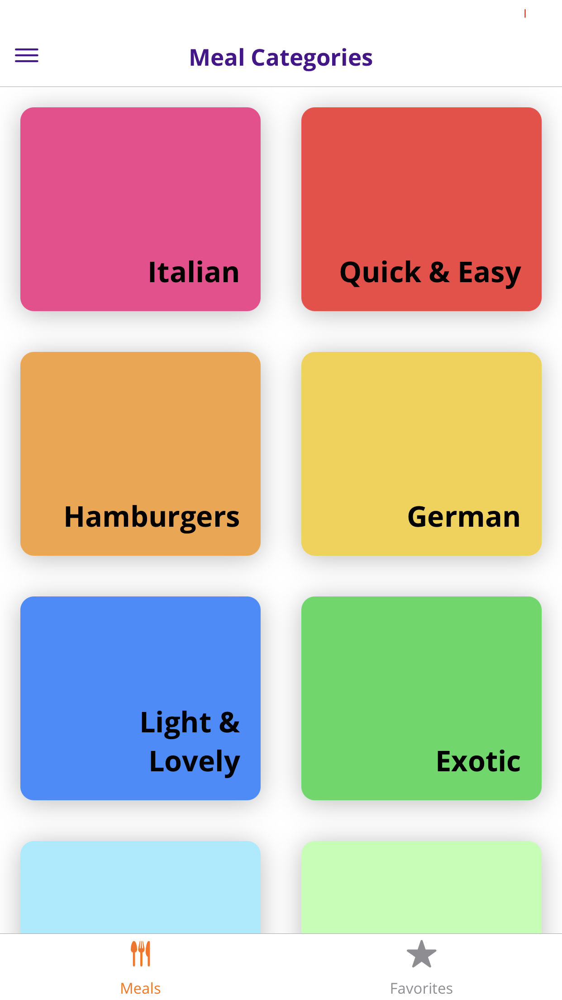
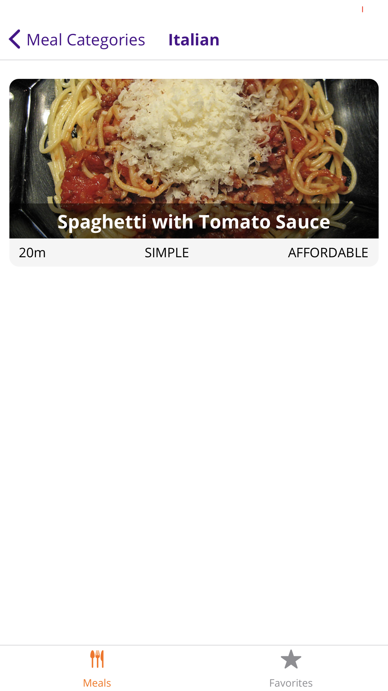

# MealsApp

Meals App for iOS and Android using React Native Expo
Features:
1. The Meals App allows the user to choose a meal based on category
2. Each meal has details on how to prepare the meal
3. Users can favorite meals and filter

This project used the following:

1. React Native Expo
2. Redux
3. iOS/Android Sims
4. CSS
5. React Hooks

To Use App:
1. Clone the repository
2. Run Yarn and npm i to install dependencies
3. Install Xcode and Android Studio for simulators
4. Run 'npm start' in terminal

